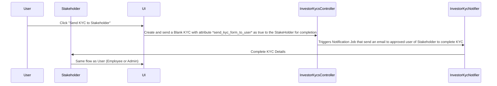

# CKYC/KRA Data Retrieval and Pre-filling Workflow Design

This document outlines the streamlined, step-wise CKYC/KRA data retrieval and pre-filling workflow within the application, initiating from the investor KYC index screen.

## Detailed Workflow Plan

The workflow is divided into three main phases: Initial Form & Data Retrieval, CKYC Workflow (Conditional), and Data Comparison & Finalization.

### Phase 1: Initial Form & Data Retrieval

1.  **Entity Enablement Check:**
    *   When the user clicks 'New KYC' from the investor KYC index screen, the system will first determine the CKYC and KRA enablement status for the current entity by checking `entity.permissions.enable_ckyc?` and `entity.permissions.enable_kra?`.
    *   This will dictate the dynamic display of fields in the initial form.
    *   **Action:** `enable_ckyc` and `enable_kra` will be added to the `permissions` flag in [`app/packs/core/entities/models/concerns/entity_enabled.rb`](app/packs/core/entities/models/concerns/entity_enabled.rb). Corresponding boolean fields will be removed from `EntitySetting`.
2.  **FI Code Validation:**
    *   A validation will be added to the `EntitySetting` model to ensure that `fi_code` is present if `entity.permissions.enable_ckyc?` or `entity.permissions.enable_kra?` is true.
3.  **Initial KYC Form (`investor_kycs/new.html.erb` / `_initial_form.html.erb`):**
    *   The form will dynamically display input fields based on the entity's enablement status:
        *   **PAN:** Always displayed.
        *   **Date of Birth (DOB):** Displayed if KRA is enabled for the entity.
        *   **Mobile Number:** Displayed if CKYC is enabled for the entity (for OTP).
    *   Upon submission, this form will trigger a compare_ckyc_kra action in `InvestorKycsController`.
4.  **Initial Data Fetch Logic (Synchronous):**
    *   Upon initial form submission, the `InvestorKycsController` will evaluate the enablement flags:
        *   **If KRA is enabled:**
            *   Call `ckyc_kra_service.rb` to fetch KRA data.
            *   UI shows message Fetching KRA Data
            *   Handle KRA API success/failure and redirect to KRA Result screen with Re-fetch/continue options.
            *   If KRA succeeds, store data in `KycData`.
        *   **If KRA is disabled AND CKYC is enabled:**
            *   *DOB Input is not displayed and KRA fetch is skipped.*
            *   Proceed directly to CKYC search.
        *   **If both KRA and CKYC are disabled:**
            *   Proceed directly to the KYC edit form (no pre-fill).
5.  **Post-KRA Fetch UI & Branching:**
    *   **If KRA is enabled and KRA data fetch completes (success/failure):**
        *   **If KRA API Fails:** Display error, "Re-fetch", "Continue to CKYC" and "Continue to Edit" buttons.
            *   **If CKYC is enabled:** 
                *   "Continue to CKYC" will initiate CKYC search.
                *   "Continue to Edit" will lead to the KYC edit form.
            *   **If CKYC is NOT enabled:** 
                *   "Continue to CKYC" is not displayed
                *   "Continue to Edit" will lead to the KYC edit form.
        *   **If KRA API Success:**
            *   **If CKYC is NOT enabled:** Display the retrieved KRA data details on the page. Show a "Select KRA Data" button (to assign KRA data to KYC and proceed to edit form) and a "Continue to Edit" button (to skip assigning KRA data and proceed to edit form).
            *   **If CKYC IS enabled:** *Do not* show KRA data details. Display a "Continue to CKYC" button (to proceed to CKYC search) and a "Continue to Edit" button (to skip CKYC and proceed to edit form, potentially with only KRA data if fetched).
    *   **If KRA is disabled AND CKYC is enabled (initial branch):**
        *   Proceed directly to CKYC search.
        *   User is redirected to *Enter OTP Screen*

### Phase 2: CKYC Workflow (Conditional)

1.  **CKYC Disabled Branch:**
    *   If CKYC is *not* enabled for the entity:
        *   If user clicks "Select KRA Data" (after KRA success), pre-fill KYC edit form with KRA data.
        *   If user clicks "Continue to Edit" (after KRA success/failure), navigate to KYC edit form without pre-filling KRA data.
2.  **CKYC Enabled Branch:**
    *   This branch is entered either after KRA data fetch (if CKYC is enabled) or directly from initial form submission (if KRA is disabled and CKYC is enabled).
    *   **CKYC Search:** The `InvestorKycsController` calls `ckyc_kra_service.rb` to perform a CKYC search.
    *   **Error Handling & Retry (CKYC Search):** 
        *   User is redirected to the "Compare CKYC/KRA" screen (showing KRA data if available, CKYC Data till error).
        *   If CKYC search fails, display error, "Re-fetch" and "Continue without Selecting" buttons. 
    *   **OTP Trigger:** If CKYC match found, `ckyc_kra_service.rb` triggers OTP.
    *   **Error Handling & Retry (OTP Trigger):** 
        *   User is redirected to the "Compare CKYC/KRA" screen (showing KRA data if available, CKYC Data till error).
        *   If CKYC search fails, display error, "Re-fetch" and "Continue without Selecting" buttons. 
    *   **'Enter OTP' Screen:** User redirected to this screen.
    *   **OTP Submission & CKYC Data Download:** Upon OTP submission, `InvestorKycsController` calls `ckyc_kra_service.rb` to download CKYC data.
    *   **Error Handling & Retry (CKYC Download/OTP):** 
        *   User is redirected to the "Compare CKYC/KRA" screen (showing KRA data if available, CKYC Data till error).
        *   If OTP fails or CKYC download fails, display error, "Retry" and "Continue without Selecting" buttons.
    *   If CKYC download succeeds, store data in `KycData`.

### Phase 3: Data Comparison & Finalization

1. **'KRA Result' Screen (`investor_kycs/fetch_kra_data.html.erb`):**
    *   After KRA search User is redirected to this scree
    *   If *CKYC* is *Disabled* User can *see and select the KRA Data* on this screen itself - reducing the number of clicks for them
    *   If *CKYC* is *Enabled* User *cannot* see and select the KRA Data on this screen - but can *Continue to CKYC* or *skip it* and go it edit Investor KYC

2.  **'Compare CKYC/KRA' Screen (`kyc_datas/compare_ckyc_kra.html.erb`):**
    *   This screen is now the central point after *any* data retrieval attempt (KRA success/failure, CKYC success/failure).
    *   It will display *all available* retrieved data (KRA, CKYC, or both, or neither).
    *   Users can selectively choose which data to use for pre-fill or skip pre-filling.
3.  **Pre-filling KYC Edit Form:**
    *   Upon the user's confirmation from the comparison screen, pre-fill the main KYC edit form (`investor_kycs/edit.html.erb`) with the selected data.
    *   User completes manual KYC.

### Phase 4: Stakeholder-Initiated KYC Completion

1. **Blank KYC Sent to Stakeholder:**
    * An employee or admin can send a blank KYC form to the stakeholder (investor) for completion.
    * The stakeholder receives a notification (email) with a link to edit the KYC.

2. **Stakeholder Accesses KYC Edit Form:**
    * When the stakeholder clicks the link, they are redirected to the KYC edit page.
    * If CKYC or KRA is enabled for the entity and no CKYC/KRA data has been assigned yet, the stakeholder starts with the **initial form**.
    * The initial form dynamically displays fields based on the entity's enablement status:
        * **PAN:** Always displayed.
        * **Date of Birth (DOB):** Displayed if KRA is enabled for the entity.
        * **Mobile Number:** Displayed if CKYC is enabled for the entity (for OTP).

3. **Stakeholder Follows CKYC/KRA Workflow:**
    * The stakeholder can follow the same multi-step process as employees:
        * **If KRA is enabled:** The system fetches KRA data first and displays the result on the "KRA Result" screen.
            * If KRA data is found, the stakeholder can choose to assign it to the KYC or proceed to CKYC (if enabled).
            * If KRA data is not found, the stakeholder can retry fetching KRA data or proceed to CKYC (if enabled).
        * **If CKYC is enabled:** The system fetches CKYC data and sends an OTP to the stakeholder's mobile number.
            * The stakeholder enters the OTP on the "Enter OTP" screen to download CKYC data.
            * If CKYC data is found, the stakeholder can assign it to the KYC.
            * If CKYC data is not found, the stakeholder can retry fetching CKYC data or proceed without assigning CKYC data.
        * **If both CKYC and KRA are disabled:** The stakeholder is redirected directly to the KYC edit form.

4. **Data Comparison & Finalization:**
    * After CKYC/KRA data retrieval, the stakeholder is redirected to the "Compare CKYC/KRA" screen.
    * This screen displays all available data (KRA, CKYC, or both) and allows the stakeholder to:
        * Select CKYC or KRA data to pre-fill the KYC form.
        * Skip pre-filling and proceed to manually complete the KYC form.

5. **Manual KYC Completion:**
    * The stakeholder completes the KYC form manually, reviewing and updating pre-filled data (if any).
    * Upon submission, the KYC is marked as completed and sent back to the entity for verification.

## Architectural Components & Responsibilities

*   **`InvestorKycsController`**: Orchestrates the entire synchronous flow, managing UI states (loading, errors), redirects, and calls to `ckyc_kra_service.rb`. It will handle the branching logic based on enablement flags and API call outcomes.
*   **`KycData` Model**: Will be used to store the fetched KRA and CKYC data. It may require new attributes to store raw API responses, CKYC reference numbers, and request IDs.
*   **`InvestorKyc` Model**: Will be updated to include associations with `KycData` and potentially new flags or fields to track the CKYC/KRA process state.
*   **`ckyc_kra_service.rb`**: This existing service will be enhanced to encapsulate all external API interactions for CKYC (search, OTP, download) and KRA data retrieval. It will handle API request/response parsing and error handling.
*   **Views:**
    *   [`investor_kycs/new.html.erb`](app/packs/core/investor_kycs/views/investor_kycs/new.html.erb) & [`_initial_form.html.erb`](app/packs/core/investor_kycs/views/investor_kycs/_initial_form.html.erb): For the initial dynamic input form, now with synchronous messages.
    *   [`investor_kycs/fetch_kra_data.html.erb`](app/packs/core/investor_kycs/views/investor_kycs/fetch_kra_data.html.erb) : For the KRA result, error and retry/continue buttons.
    *   [`kyc_datas/enter_ckyc_otp.html.erb`](app/packs/core/investor_kycs/views/kyc_datas/enter_ckyc_otp.html.erb): For the CKYC OTP input.
    *   [`kyc_datas/compare_ckyc_kra.html.erb`](app/packs/core/investor_kycs/views/kyc_datas/compare_ckyc_kra.html.erb): **Centralized comparison screen**, flexible to display partial or complete data, with selection/skip options.
    *   [`investor_kycs/edit.html.erb`](app/packs/core/investor_kycs/views/investor_kycs/edit.html.erb): The final KYC edit form for pre-filling and manual completion.
*   **Policies:** 
    * *investor_kyc_policy.rb* and *kyc_data_policy.rb* Will be updated to ensure proper authorization for accessing and modifying KYC data throughout the new workflow.
*   **Entity Configuration:**
    *   [`app/packs/core/entities/models/concerns/entity_enabled.rb`](app/packs/core/entities/models/concerns/entity_enabled.rb): Add `enable_ckyc` and `enable_kra` to the `permissions` flag.
    *   `EntitySetting` model: Remove `ckyc_enabled` and `kra_enabled` boolean fields.
    *   `EntitySetting` model: Add validation for `fi_code` presence if `entity.permissions.enable_ckyc?` or `entity.permissions.enable_kra?` is true.

## Workflow Diagram

```mermaid
sequenceDiagram
    participant User
    participant UI
    participant InvestorKycsController
    participant Entity
    participant EntitySetting
    participant KycData
    participant CKYC_KRA_Service
    participant KRA_API
    participant CKYC_API

    User->>UI: Click "New KYC"
    UI->>InvestorKycsController: Request New KYC Form
    InvestorKycsController->>Entity: Get Entity
    Entity->>Entity: Check CKYC/KRA Enablement Flags (via permissions in entity_enabled.rb)
    Entity-->>InvestorKycsController: Enablement Status (CKYC_Enabled, KRA_Enabled)

    InvestorKycsController-->>UI: Render Initial Form (dynamic fields based on enablement)
    User->>UI: Enter PAN, (DOB if KRA_Enabled), (Mobile No if CKYC_Enabled)
    UI->>InvestorKycsController: Submit Initial Form (PAN, DOB, Mobile No)
    UI->>UI: Show Loading Indicator

    alt KRA_Enabled is true
        InvestorKycsController->>CKYC_KRA_Service: Call KRA API (PAN, DOB)
        CKYC_KRA_Service->>KRA_API: Request KRA Data
        KRA_API-->>CKYC_KRA_Service: KRA Data / Error
        CKYC_KRA_Service-->>InvestorKycsController: KRA Data / Error
        alt KRA API Fails
            InvestorKycsController-->>UI: Display Error, Retry/Continue Buttons
            User->>UI: Click Retry OR Continue
            alt Click Retry
                UI->>InvestorKycsController: Re-submit KRA Fetch Request
            else Click Continue
                alt CKYC_Enabled is true
                    InvestorKycsController->>CKYC_KRA_Service: Initiate CKYC Search (PAN + FI Code)
                    CKYC_KRA_Service->>CKYC_API: Search CKYC
                    CKYC_API-->>CKYC_KRA_Service: CKYC Ref No / No Match
                    CKYC_KRA_Service-->>InvestorKycsController: CKYC Search Result
                    alt CKYC Search Fails / Not Found
                        InvestorKycsController-->>UI: Redirect to "Compare CKYC/KRA" (with CKYC_Search_Failed status)
                    else CKYC Match Found
                        InvestorKycsController->>CKYC_KRA_Service: Send CKYC OTP (Mobile No, CKYC Ref No, Request ID)
                        CKYC_KRA_Service->>CKYC_API: Send CKYC OTP
                        CKYC_API-->>CKYC_KRA_Service: OTP Sent Confirmation / Error
                        CKYC_KRA_Service-->>InvestorKycsController: OTP Triggered / Error
                        alt OTP Send Fails
                            InvestorKycsController-->>UI: Redirect to "Compare CKYC/KRA" (with CKYC_OTP_Failed status)
                        else OTP Sent
                            InvestorKycsController-->>UI: Redirect to "Enter OTP" Screen
                            User->>UI: Enter OTP
                            UI->>InvestorKycsController: Submit OTP (OTP, Request ID, CKYC Ref No)
                            UI->>UI: Show Loading Indicator
                            InvestorKycsController->>CKYC_KRA_Service: Download CKYC Data
                            CKYC_KRA_Service->>CKYC_API: Download CKYC Data (OTP, Request ID, CKYC Ref No)
                            CKYC_API-->>CKYC_KRA_Service: CKYC Data / Error
                            CKYC_KRA_Service-->>InvestorKycsController: CKYC Data / Error
                            alt CKYC Download Fails
                                InvestorKycsController-->>UI: Redirect to "Compare CKYC/KRA" (with CKYC_Download_Failed status)
                            else CKYC Download Success
                                InvestorKycsController->>KycData: Save CKYC Data
                                KycData-->>InvestorKycsController: CKYC Data Saved
                                InvestorKycsController-->>UI: Redirect to "Compare CKYC/KRA" Screen (with CKYC success message)
                            end
                        end
                    end
                else CKYC_Enabled is false
                    InvestorKycsController-->>UI: Redirect to KYC Edit Form (no pre-fill)
                end
            end
        else KRA API Success
            InvestorKycsController->>KycData: Save KRA Data
            KycData-->>InvestorKycsController: KRA Data Saved
            alt CKYC_Enabled is false
                InvestorKycsController-->>UI: Display KRA Data, success message and "Select KRA Data" / "Continue to Edit" Buttons
                User->>UI: Click "Select KRA Data" OR "Continue to Edit"
                alt Click "Select KRA Data"
                    UI->>InvestorKycsController: Pre-fill KYC Edit Form with KRA Data
                    InvestorKycsController-->>UI: Redirect to KYC Edit Form
                else Click "Continue to Edit"
                    UI->>InvestorKycsController: Redirect to KYC Edit Form (no pre-fill)
                end
            else CKYC_Enabled is true
                InvestorKycsController-->>UI: Hide Loading, Display "Continue to CKYC" / "Continue to Edit" Buttons (no KRA data details)
                User->>UI: Click "Continue to CKYC" OR "Continue to Edit"
                alt Click "Continue to CKYC"
                    InvestorKycsController->>CKYC_KRA_Service: Search CKYC (PAN + FI Code)
                    CKYC_KRA_Service->>CKYC_API: Search CKYC
                    CKYC_API-->>CKYC_KRA_Service: CKYC Ref No / No Match
                    CKYC_KRA_Service-->>InvestorKycsController: CKYC Search Result
                    alt CKYC Search Fails / Not Found
                        InvestorKycsController-->>UI: Redirect to "Compare CKYC/KRA" (with KRA data if available, CKYC_Search_Failed status)
                    else CKYC Match Found
                        InvestorKycsController->>CKYC_KRA_Service: Send CKYC OTP (Mobile No, CKYC Ref No, Request ID)
                        CKYC_KRA_Service->>CKYC_API: Send CKYC OTP
                        CKYC_API-->>CKYC_KRA_Service: OTP Sent Confirmation / Error
                        CKYC_KRA_Service-->>InvestorKycsController: OTP Triggered / Error
                        alt OTP Send Fails
                            InvestorKycsController-->>UI: Redirect to "Compare CKYC/KRA" (with KRA data if available, CKYC_OTP_Failed status)
                        else OTP Sent
                            InvestorKycsController-->>UI: Hide Loading, Redirect to "Enter OTP" Screen
                            User->>UI: Enter OTP
                            UI->>InvestorKycsController: Submit OTP (OTP, Request ID, CKYC Ref No)
                            UI->>UI: Show Loading Indicator
                            InvestorKycsController->>CKYC_KRA_Service: Download CKYC Data
                            CKYC_KRA_Service->>CKYC_API: Download CKYC Data (OTP, Request ID, CKYC Ref No)
                            CKYC_API-->>CKYC_KRA_Service: CKYC Data / Error
                            CKYC_KRA_Service-->>InvestorKycsController: CKYC Data / Error
                            alt CKYC Download Fails
                                InvestorKycsController-->>UI: Redirect to "Compare CKYC/KRA" (with KRA data if available, CKYC_Download_Failed status)
                            else CKYC Download Success
                                InvestorKycsController->>KycData: Save CKYC Data
                                KycData-->>InvestorKycsController: CKYC Data Saved
                                InvestorKycsController-->>UI: Hide Loading, Redirect to "Compare CKYC/KRA" Screen (with CKYC success message)
                            end
                        end
                    end
                else Click "Continue to Edit"
                    UI->>InvestorKycsController: Redirect to KYC Edit Form (no pre-fill)
                end
            end
        end
    else if KRA_Enabled is false AND CKYC_Enabled is true
        InvestorKycsController->>CKYC_KRA_Service: Search CKYC (PAN + FI Code)
        CKYC_KRA_Service->>CKYC_API: Search CKYC
        CKYC_API-->>CKYC_KRA_Service: CKYC Ref No / No Match
        CKYC_KRA_Service-->>InvestorKycsController: CKYC Search Result
        alt CKYC Search Fails / Not Found
            InvestorKycsController-->>UI: Redirect to "Compare CKYC/KRA" (no KRA data, CKYC_Search_Failed status)
        else CKYC Match Found
            InvestorKycsController->>CKYC_KRA_Service: Send CKYC OTP (Mobile No, CKYC Ref No, Request ID)
            CKYC_KRA_Service->>CKYC_API: Send CKYC OTP
            CKYC_API-->>CKYC_KRA_Service: OTP Sent Confirmation / Error
            CKYC_KRA_Service-->>InvestorKycsController: OTP Triggered / Error
            alt OTP Send Fails
                InvestorKycsController-->>UI: Redirect to "Compare CKYC/KRA" (no KRA data, CKYC_OTP_Failed status)
            else OTP Sent
                InvestorKycsController-->>UI: Hide Loading, Redirect to "Enter OTP" Screen
                User->>UI: Enter OTP
                UI->>InvestorKycsController: Submit OTP (OTP, Request ID, CKYC Ref No)
                UI->>UI: Show Loading Indicator
                InvestorKycsController->>CKYC_KRA_Service: Download CKYC Data
                CKYC_KRA_Service->>CKYC_API: Download CKYC Data (OTP, Request ID, CKYC Ref No)
                CKYC_API-->>CKYC_KRA_Service: CKYC Data / Error
                CKYC_KRA_Service-->>InvestorKycsController: CKYC Data / Error
                alt CKYC Download Fails
                    InvestorKycsController-->>UI: Redirect to "Compare CKYC/KRA" (no KRA data, CKYC_Download_Failed status)
                else CKYC Download Success
                    InvestorKycsController->>KycData: Save CKYC Data
                    KycData-->>InvestorKycsController: CKYC Data Saved
                    InvestorKycsController-->>UI: Hide Loading, Redirect to "Compare CKYC/KRA" Screen (with CKYC data and success message)
                end
            end
        end
    else KRA_Enabled is false AND CKYC_Enabled is false
        InvestorKycsController-->>UI: Redirect to KYC Edit Form (no pre-fill)
    end

    UI-->>User: Display CKYC & KRA Data for Comparison (whatever is available)
    User->>UI: Select Fields to Pre-fill / Skip Pre-fill
    UI->>InvestorKycsController: Submit Selection
    InvestorKycsController-->>UI: Redirect to KYC Edit Form
    UI-->>User: Pre-fill KYC Edit Form with Selected Data
    User->>UI: Complete Manual KYC / Review Pre-filled Data
```

## StakeHolder-Initiated CKYC/KRA workflow

